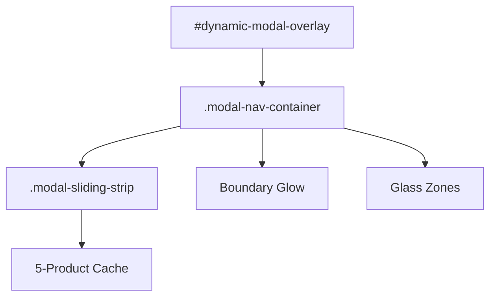

# Project Philosophy: Feature Preservation & Architectural Constraints

This document defines the core technical rules and the philosophy of "Feature Preservation" for this project. Adherence to these rules is mandatory to prevent regressions and loss of implementation time.

## 🛡️ Feature Preservation Philosophy

> [!IMPORTANT]
> **Every line of code is a feature.**
- **Strict Scope Adheresence**: You must only modify code that is directly within the current task's scope.
- **CRUD Operations Risk**: Any Create, Update, or Delete operation on existing code can lead to severe regressions, breaking established features and causing massive project delays.
- **Impact Notification Rule**: If a proposed change, update, or deletion might impact a feature or component outside the immediate scope, you **MUST** provide a detailed impact list separately and wait for **Accept/Reject approval** before proceeding.

---

## 🏗️ Architectural Constraints (Product Modal)

### 1. The "No-Touch" Rule
The internal HTML logic of `.simple-modal-content` is a **No-Touch Zone**. Modifications must only happen via wrappers, siblings, or non-propagating event handlers.

### 2. Sliding Strip & Caching
- **Windowed Caching**: Maintain exactly 5 products `[P-2, P-1, Active, N+1, N+2]` in the DOM.
- **Hardware Acceleration**: Only use `translateX` for navigation. Position re-centering must happen instantly (`transition: none`) on `transitionend`.

### 3. Elasticity & Feedback
- **Dampening**: Apply a **0.25x multiplier** to drag distance at boundaries.
- **Visual Feedback**: The Red Edge Glow and the Premium Blue Content Glow must be preserved and scaled via CSS variables.

### 4. Theme & Variable Unity
Design changes must always respect the 3-theme parity (**Classic**, **Glass**, **Dark/Light**). Root variables (e.g., `--glass-refraction`, `--glass-blur`) must be used for all styling to ensure global propagation.

### 5. Event Isolation
The `.modal-image-gallery` and other interactive elements must strictly use `event.stopPropagation()` to prevent unintended modal navigation.

### 6. Button Standardization
All buttons in the project **must** be sourced from `buttons.css`. If a required button style does not exist, it must be added to `buttons.css` first, then called from there. This ensures consistency, reusability, and maintainability across the entire project.

---

## 🏗️ Responsive & Safe-Area Constraints

### 1. Global Safety Strategy
The project uses a centralized Safe-Area strategy in `responsive.css`. All primary content wrappers must use the `.container` class to automatically inherit `env(safe-area-inset)` protection.

### 2. Floating Element Positioning
New floating or absolute-positioned elements (Close buttons, Floating Menus, Navigation bars) must utilize `env(safe-area-inset-...)` to prevent clipping by the **Notch** or **Dynamic Island**:
- **Right Alignment**: `calc(OFFSET + env(safe-area-inset-right, 0px))`
- **Top Alignment**: `calc(OFFSET + env(safe-area-inset-top, 0px))`

### 3. Landscape Density Polish
Mobile landscape is height-constrained. New components should include scaling overrides in `responsive.css` to reduce font sizes, padding, and gaps when `(orientation: landscape)` is active. This ensures the UI feels proportional and maintains a high information density without feeling "oversized."

---

## 🏗️ Architecture Summary

