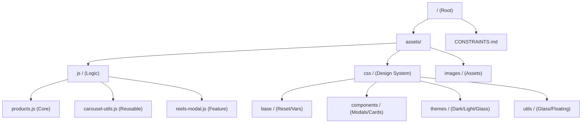

# READ_PROJECT_ARCHITECTURE.md

Welcome to the **VibeDrips** architecture guide. This document outlines the core technical philosophies and structural patterns that power this high-performance affiliate drop platform.

---

## 🛡️ Core Philosophies

### 1. Feature Preservation
As defined in `CONSTRAINTS.md`, we follow a strict **"No-Touch"** philosophy for established UI logic.
- **Rule**: Every line of code is a feature. 
- **Practice**: We avoid destructive `innerHTML` wipes or global refactors. Instead, we use surgical DOM updates to preserve state and performance.

### 2. High-Performance Carousing ("Zero-Flash")
VibeDrips uses a custom-built navigation engine designed for mobile-first speed.
- **Windowed Caching**: Exactly 5 products `[P-2, P-1, Active, N+1, N+2]` are maintained in the DOM at any time.
- **Surgical Node Rotation**: Instead of rebuilding the slider on every switch, we rotate DOM nodes (pop/push). This keeps the **Active** product stable in the DOM, preventing flickering ("flashing") and preserving image pre-loads.
- **Atomic Teleport**: Re-centering happens instantly (`transition: none`) on `transitionend`, creating an infinite-feeling scroll loop.

### 3. GPU-First Rendering
To ensure "Butter-Smooth" transitions on mobile devices:
- We exclusively use `translate3d` for movement.
- **GPU Hardening**: All carousing containers use `backface-visibility: hidden` and `transform-style: preserve-3d` to force graphics-layer acceleration.

---

## 🏗️ Directory Structure

### Essential Files
- **`index.html`**: The entry point, containing the PWA manifest and static modal roots.
- **`assets/js/products.js`**: The heartbeat of the application, managing data fetching, filtering, and the complex sliding modal engine.
- **`assets/js/carousel-utils.js`**: Shared logic for image galleries, swipe detection, and counter-state.
- **`assets/css/main.css`**: The central import point for the design system.

---

## 💎 The Glass Design System

VibeDrips utilizes a **Glass-Morphic Theme** that is fully reactive.
- **Variable-Driven**: All transparency, blur, and color values are controlled via CSS variables (e.g., `--glass-refraction`, `--glass-blur`).
- **Theme Parity**: Every component must work across **Classic**, **Glass**, **Light**, and **Dark** modes through unified variables.

---

## 📱 Mobile-First Optimizations

- **Safe-Area Awareness**: All floating elements dodge the "Notch" and "Home Bar" using `env(safe-area-inset)`.
- **Landscape Tuning**: Custom adjustments in `responsive.css` ensure the UI remains usable at high information density in landscape mode.
- **PWA Ready**: manifest-driven splash screens and home-screen icon support.

---

> [!IMPORTANT]
> When modifying this codebase, always refer to `CONSTRAINTS.md` and `assets/css/READ_CSS_ARCHITECTURE.md` to ensure your changes align with these established patterns.
