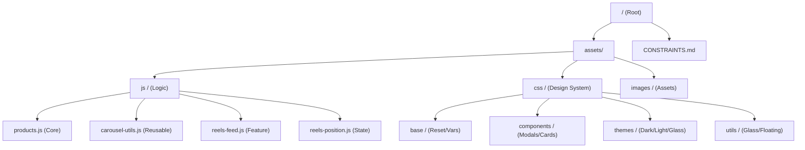

# READ_PROJECT_ARCHITECTURE.md

Welcome to the **VibeDrips** architecture guide. This document outlines the core technical philosophies and structural patterns that power this high-performance affiliate drop platform.

---

## 🛡️ Core Philosophies

### 1. Feature Preservation
As defined in `CONSTRAINTS.md`, we follow a strict **"No-Touch"** philosophy for established UI logic.
- **Rule**: Every line of code is a feature. 
- **Practice**: We avoid destructive `innerHTML` wipes or global refactors. Instead, we use surgical DOM updates to preserve state and performance.

### 2. High-Performance Carousing ("Zero-Flash")
VibeDrips uses a custom-built navigation engine designed for mobile-first speed.
- **Windowed Caching**: Exactly 5 products `[P-2, P-1, Active, N+1, N+2]` are maintained in the DOM at any time.
- **Surgical Node Rotation**: Instead of rebuilding the slider on every switch, we rotate DOM nodes (pop/push). This keeps the **Active** product stable in the DOM, preventing flickering ("flashing") and preserving image pre-loads.
- **Atomic Teleport**: Re-centering happens instantly (`transition: none`) on `transitionend`, creating an infinite-feeling scroll loop.

### 3. GPU-First Rendering
To ensure "Butter-Smooth" transitions on mobile devices:
- We exclusively use `translateX` and `translate3d` for movement.
- **GPU Hardening**: All carousing containers use `backface-visibility: hidden` and `transform-style: preserve-3d` to force graphics-layer acceleration.
- **Interactivity Warmup**: To prevent "Cold-Start" hitching during clicks, we use `mousedown`/`touchstart` to pre-prime the graphics layer with a micro-offset (0.01px). This ensures the compositor is already warm before the animation begins.
- **Layer Lean Strategy**: Only the primary moving container is layerized; redundant child GPU layers are avoided to prevent memory pressure and composition stalls ("Layer Inflation").

---

## 🏗️ Directory Structure

### Essential Files
- **`index.html`**: The entry point, containing the PWA manifest and static modal roots.
- **`assets/js/products.js`**: The heartbeat of the application, managing data fetching, filtering, and the complex sliding modal engine.
- **`assets/js/carousel-utils.js`**: Shared logic for image galleries, swipe detection, and counter-state.
- **`assets/css/main.css`**: The central import point for the design system.

---

## 💎 The Glass Design System

VibeDrips utilizes a **Glass-Morphic Theme** that is fully reactive.
- **Variable-Driven**: All transparency, blur, and color values are controlled via CSS variables (e.g., `--glass-refraction`, `--glass-blur`).
- **Theme Parity**: Every component must work across **Classic**, **Glass**, **Light**, and **Dark** modes through unified variables.

---

## 📱 Mobile-First Optimizations

- **Safe-Area Awareness**: All floating elements dodge the "Notch" and "Home Bar" using `env(safe-area-inset)`.
- **Landscape Tuning**: Custom adjustments in `responsive.css` ensure the UI remains usable at high information density in landscape mode.
- **Dynamic Height Economy**: We use `height: auto` combined with relative `max-height` (e.g., `70vh`) in landscape view. This ensures containers shrink to fit their content, eliminating "Ghost Space" left by hidden UI elements like counters.
- **PWA Ready**: manifest-driven splash screens and home-screen icon support.

---

## 🛰️ External Controls & Contextual Intelligence

Adjacent to the product modal, we maintain a floating control layer that provides secondary interaction and product context.

### 1. The News Ticker (Informational Awareness)
- **Concept**: A hardware-accelerated marquee that provides non-stop informational context (e.g., region availability, media references).
- **Behavior**: The ticker bubble is context-aware; it programmatically hides when a primary tool (like Reels or Globe Map) is selected, ensuring the user's focus remains on the active secondary interface.

### 2. Toggle State Machine
- **Mutual Exclusion**: We implement a "One-Focus" rule. Activating one external toggle (Reels or Globe) automatically deactivates the other.
- **State Persistence**: Hovering and Selection states use high-specificity CSS to ensure theme-parity branding (Unified Purple Glow) is maintained across Light, Dark, and Glass themes.

- **Layer Isolation**: These controls are injected into the `.modal-layout-wrapper` as a peer to the `.modal-nav-container`. This allows them to bypass established navigation "No-Touch" rules while remaining perfectly aligned with the modal's center-point.

---

## 🎭 Advanced Media Architecture (Phases 8-10)

### 1. Sliding Media Engine (v2)
Implemented in `MediaLightbox`, this engine extends the "Zero-Flash" philosophy to social media embeds.
- **5-Slot Preloading**: We maintain a sliding window of 5 slides. This allows the system to preload high-weight iframes (YouTube/TikTok) before the user even considers swiping to them.
- **Active Selection**: Only the slot at the absolute center (3rd slot, `-200%` translation) is permitted to output audio or receive autoplay parameters (`autoplay=1`).
- **Memory Garbage Collection**: Media that exits the 5-item window is physically purged from the DOM to prevent memory leaks during long browsing sessions.

### 2. The Unified Gesture Layer (Sensitive Shield)
On mobile, the struggle between "Video Interaction" and "Gallery Navigation" is solved via the **Sensitive Shield**.
- **The Concept**: A global invisible listener layer that sits **above** the media but **below** the UI controls.
- **Input Routing**:
    - **Horizontal Drag**: Intercepted by the shield and converted to slide movements.
    - **Fast Tap**: Programmatically forwarded (Proxied) to the hidden media element to trigger unmuting/play pulses.
- **Why?**: This prevents "Tap-to-Mute" controls in iframes from "stalling" the user's attempt to swipe to the next product.

### 3. Unified Media Handover (The "One-Stream" Rule)
To prevent audio chaos, the project implements a global handover system:
- **Identifier-Based Sync**: Components like `ReelsFeed`, `MediaOverlay`, and `MediaLightbox` report their playback via `MediaState.reportMediaPlay(senderId)`.
- **Automatic Pause**: When a component detects a `vibedrips-media-play` event from a *different* `senderId`, it immediately pauses its own media. This ensures that only one primary media source plays audio at any time.
- **Background Music**: Background music (Music Control) listens to all play events and pauses automatically, but remains as the fallback when all foreground media stops.

### 4. Asymmetric Media Strategy (Mobile-First Focus)

To balance performance on restricted mobile browsers with high-speed autoplay on desktop, the project implements platform-aware context guarding.
- **Mobile Logic**: Background components (like `ReelsFeed`) implement strict **Focus Guards**. They actively scan for active foreground components (Media Overlay, Lightbox) before unmuting or pulsing media. This prevents "Foreground Displacement," where background reels hijack the audio channel from the user's active view.
- **Desktop Logic**: Guards are bypassed (`!Device.isMobile()`) to allow full autoplay capabilities. Desktop browsers have less restrictive audio-focus policies and higher processing budgets, making restrictive guards unnecessary and obstructive.
- **Context Guarding**: Background services must check both visibility and activity (e.g., `isMediaOverlayActive` and `isProductModalActive`) before executing high-priority media pulses.

---

## 💎 Known Architectural Gaps (Waitlist)
Despite recent advancements, some patterns remain in the tracking phase:
- **One-Way Slider Binding**: The header volume slider propagates its value to media, but media changes (e.g., native adjustments) do not reflect back to the slider.
- **Cross-Component Persistence**: Volume preference is perfectly synced, but the *Muted State* is intentionally asymmetric to support platform-specific rules (iOS strictly Muted-First).

---

## 5. Regional Warp Logic
The "Regional Discovery & Share" system enables a seamless jump between the static product catalog and the dynamic media reels.

### One-Focus Interaction Rule
To maintain visual clarity, the External Controls bubble follows a strict mutual exclusion rule:
- **🎬 Reels Active**: Displays the media-gallery zoom mirror. The globe dropdown is hidden.
- **🌎 Globe Active**: Displays "Warp Marketplace" feedback text. The reels control is static.

### State Transitions
State is preserved during these jumps using the `vibedrips-last-reel-url` key in `localStorage`. This ensures that when a user "warps" to a marketplace, the UI remembers their exact position in the reel feed upon landing.
